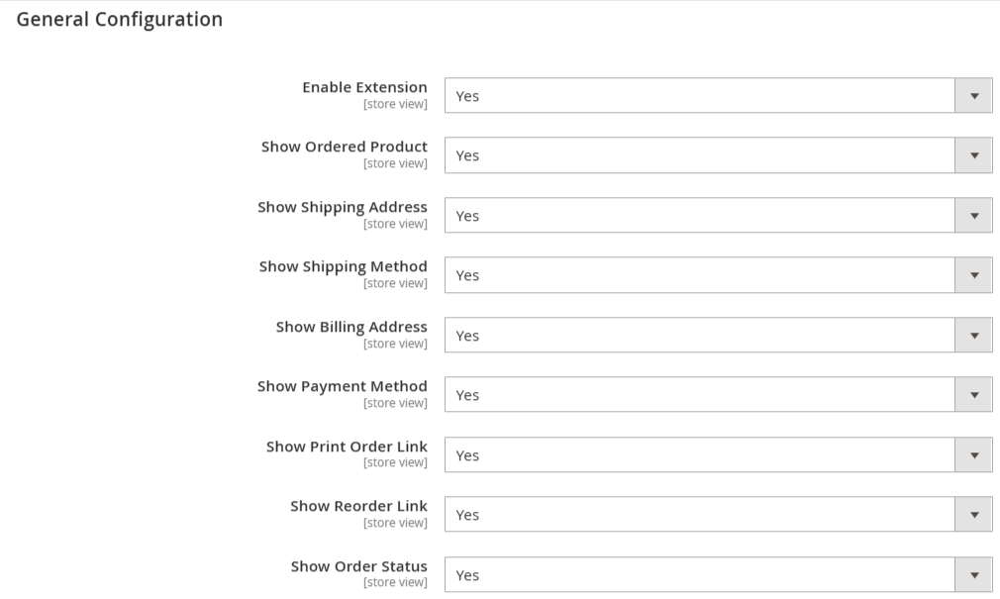

# Magento 2 Order Information on Success Page Extension

Empower your Magento 2 store with the ability to provide comprehensive order details right on the order success page. Our Magento 2 Order Information Extension enhances the post-purchase experience by displaying crucial order information, streamlining the process for both merchants and customers. 
**[Order Information on Success Page for Magento 2](https://mavenbird.com/magento-2-order-information-on-success-page.html)** 

## Key Features:

- **Customer Order Details:**
Display Billing and Shipping Address prominently for easy reference.
- **Shipping and Payment Methods:**
Clearly present chosen Shipping and Payment methods for transparency.
- **Order Status:**
Instantly inform customers about the status of their orders.
- **Print Order:**
Enable customers to print their order details directly from the success page.
- **Re-Order Functionality:**
Simplify the re-order process by offering a one-click re-order option.
- **Comprehensive Product Information:**
Showcase Product Name, Image, Quantity, Configuration, and Price for each item in the order.

## Benefits:

- **Enhanced Customer Experience:**
Provide a seamless post-purchase experience with all necessary order information readily available.
- **Improved Transparency:**
Increase trust and transparency by clearly displaying shipping, payment, and order status details.
- **Streamlined Re-Order Process:**
Encourage repeat purchases by simplifying the re-ordering process for customers.
- **Efficient Order Management:**
Enable merchants to efficiently manage orders with comprehensive information available at a glance.

## Compatibility:
This extension is compatible with Magento 2.x versions, ensuring seamless integration with your existing store setup.

## Installation:
**Install via composer (recommend)** - 

Easy installation process with step-by-step instructions provided for hassle-free setup.
~~~~~~~~~~~~~~~~~~~~~
composer require mavenbird/order-info-on-success-page-magento2
php bin/magento setup:upgrade
php bin/magento setup:di:compile
php bin/magento setup:static-content:deploy
php bin/magento cache:flush
~~~~~~~~~~~~~~~~~~~~~

## Upgrade/Update Module:
Run the following command in Magento 2 root folder for easy update -
~~~~~~~~~~~~~~~~~~~~~
composer update mavenbird/order-info-on-success-page-magento2
php bin/magento setup:upgrade
php bin/magento setup:di:compile
php bin/magento setup:static-content:deploy
php bin/magento cache:flush
~~~~~~~~~~~~~~~~~~~~~

## Customization Options:
Tailor the display of order information to match your store's branding and layout preferences with customizable templates and styling options.

**Configure at Your Ease**

## Support:
Dedicated support team available to assist with installation, customization, and any other queries or concerns.
**[support@mavenbird.com](mailto:support@mavenbird.com)** 

## Get Started:
Transform your order success page into a hub of valuable information for your customers with our Magento 2 Order Information Extension. Elevate the post-purchase experience and drive customer satisfaction and loyalty today!

**Thank you!**
